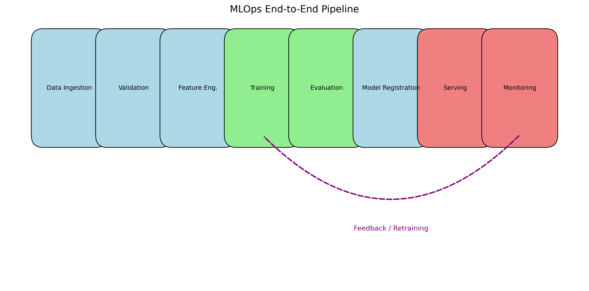

# MLOps CI/CD Pipeline


## Project Objective

This repository demonstrates a production-grade MLOps pipeline for an end-to-end Machine Learning workflow. The primary goal is to showcase automated data validation, model training, evaluation, registration, and deployment without relying on specific hardware or operating system dependencies. It implements a robust CI/CD process using GitHub Actions and orchestrates the ML lifecycle using MLflow and Kubeflow Pipelines.

## Overview

The pipeline consists of the following stages:

1.  **Data Ingestion & Validation**: Synthetic data generation and schema validation.
2.  **Model Training**: Training a Scikit-Learn model with automated experiment tracking via MLflow.
3.  **Evaluation**: rigorous model evaluation producing metrics (Accuracy, F1, ROC-AUC) and visualization plots.
4.  **Model Registry**: Automated registration of the best-performing model versions.
5.  **Serving**: Deployment of the model via a REST API (Flask) containerized with Docker.
6.  **Monitoring**: Continuous monitoring for data drift and model performance degradation.
7.  **CI/CD**: Automated testing, building, and deployment simulation using GitHub Actions.

### Pipeline Flow

The following diagram illustrates the runtime behavior and data flow of the system:



## Repository Structure

```
mlops-ci-cd-pipeline/
├── .github/              # GitHub Actions workflows
├── badges/               # Project badges
├── ci-cd/                # CI/CD configurations
├── data/                 # Dataset storage
│   ├── raw/
│   └── processed/
├── docs/                 # Documentation
├── evaluation/           # Evaluation scripts
├── mlflow/               # MLflow hooks
├── models/               # Serialized models
├── monitoring/           # Drift detection
├── outputs/              # Artifacts & outputs
├── pipeline/             # Kubeflow pipelines
├── serving/              # Inference service
├── training/             # Training scripts
├── requirements.txt      # Dependencies
├── hyperparams.yaml      # Configuration
└── run_pipeline.ps1      # Execution helper
```

## Getting Started

### Prerequisites

*   Python 3.8+
*   Docker (optional, for containerization)

### Installation

1.  Clone the repository:
    ```bash
    git clone https://github.com/F-Karakaya/mlops-ci-cd-pipeline.git
    cd mlops-ci-cd-pipeline
    ```
2.  Install dependencies:
    ```bash
    pip install -r requirements.txt
    ```

### Usage

**Run the Full Pipeline (Local):**

A PowerShell helper script is provided to execute the entire pipeline sequentially:

```powershell
./run_pipeline.ps1
```

**Individual Steps:**

*   **Data Generation**: `python data/data_validation.py`
*   **Train**: `python training/train.py`
*   **Evaluate**: `python evaluation/evaluate.py`
*   **Serve**: `python serving/serve.py`

**Inference Request Example:**

Once the server is running (via `python serving/serve.py`), you can test it:

```python
import requests
response = requests.post("http://localhost:5000/predict", json={"instances": [[0.1, 0.5, ...]]})
print(response.json())
```

See `serving/inference_example.py` for a complete example.

## Documentation

*   [MLOps Overview](docs/mlops_overview.md)
*   [CI/CD Workflow](docs/ci_cd_flow.md)
*   [Monitoring Strategy](docs/monitoring_strategy.md)

## Outputs

Generated artifacts are stored in the `outputs/` directory:

*   **Model Versions**: [See registered models](outputs/model_versions.md)
*   **Pipeline Run**: `outputs/pipeline_run.png`
*   **Monitoring**: `outputs/monitoring/data_drift.png`, `outputs/monitoring/performance_drift.png`
*   **MLflow Runs**: `outputs/mlflow_runs/run_screenshot.png`

---

👤 **Author**

**Furkan Karakaya**
AI & Computer Vision Engineer
📧 se.furkankarakaya@gmail.com
⭐ If this project helps your workflow or research, consider starring the repository.
